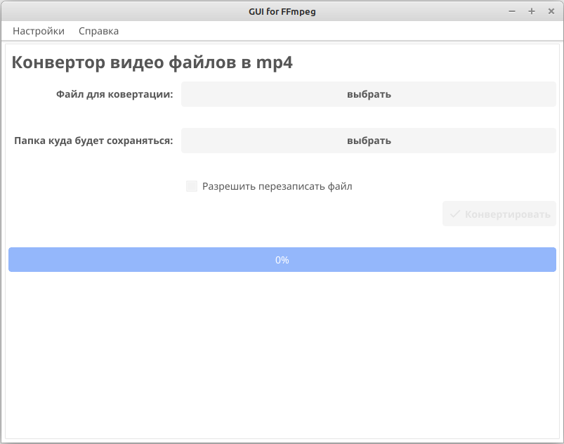
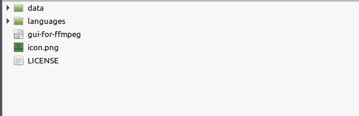

# GUI for FFmpeg

Простенький интерфейс для консольной утилиты FFmpeg. Но я <strong>не являюсь</strong> автором самой утилиты <strong>FFmpeg</strong>.

<strong>FFmpeg</strong> — торговая марка <strong><a href="http://bellard.org/" target="_blank">Fabrice Bellard</a></strong>, создателя проекта <strong><a href="https://ffmpeg.org/about.html" target="_blank">FFmpeg</a></strong>.

Скачать скомпилированные готовые версии можно тут: <a href="https://git.kor-elf.net/kor-elf/gui-for-ffmpeg/releases">https://git.kor-elf.net/kor-elf/gui-for-ffmpeg/releases</a>.

## Установка через fyne:
1. go install fyne.io/fyne/v2/cmd/fyne@latest
2. fyne get git.kor-elf.net/kor-elf/gui-for-ffmpeg/src

## Скомпилировать через исходники:
1. git clone https://git.kor-elf.net/kor-elf/gui-for-ffmpeg.git
2. Переходим в папку проекта и там переходим в папку src: **cd gui-for-ffmpeg/src**
3. Ознакамливаемся, что нужно ещё установить для Вашей ОС для простого запуска (через go run) тут: https://docs.fyne.io/started/
4. *(не обязательный шаг)* Просто запустить можно так: **go run main.go**
5. go install github.com/fyne-io/fyne-cross@latest
   * У Вас так же должен быть установлен docker
   * О fyne-cross можно по подробней почитать тут: https://github.com/fyne-io/fyne-cross
6. * fyne-cross windows --icon icon.png --app-id "." -name "gui-for-ffmpeg"
   * fyne-cross linux --icon icon.png --app-id "." -name "gui-for-ffmpeg"
7. Создаться папка **fyne-cross/bin** и там будет созданна папка с тем названием под которую Вы компилировали приложения (linux-amd64 или windows-amd64).
8. В папку **fyne-cross/bin/linux-amd64** или **fyne-cross/bin/windows-amd64** копируете:
   * src/icon.png
   * src/data
   * src/languages
   * LICENSE

<strong>Структура должна получиться такая:</strong>

## Работа с переводами:
1. go install -v github.com/nicksnyder/go-i18n/v2/goi18n@latest
2. Переходим в папке проекта в папку src: **cd ./src**
3. goi18n merge -sourceLanguage ru -outdir languages languages/active.\*.toml languages/translate.\*.toml
4. В файлах **languages/translate.\*.toml** переводим текст на нужный язык
5. goi18n merge -sourceLanguage ru -outdir languages languages/active.\*.toml languages/translate.\*.toml

Более подробно можно почитать тут: https://github.com/nicksnyder/go-i18n